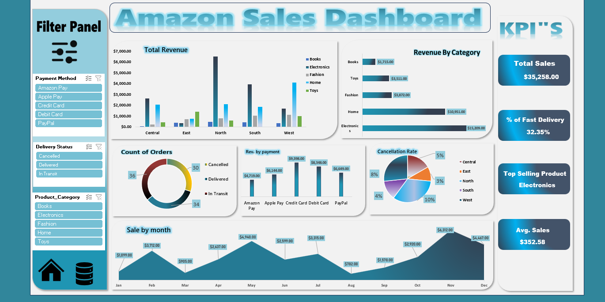
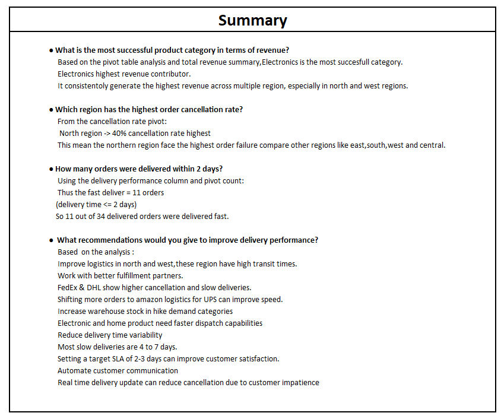

# Sales Intelligence Dashboard 

_As a Business Analyst for a Amazon company aiming to build an integrated Excel report combining sales._

---

## 📑 Table of Contents
- [Dataset](#-dataset)
- [Dashboard](#-dashboard)
- [How to Run the Project](#-how-to-run-the-project)
- [Summary_report](#-summary_rport)
- [Task Breakdown](#-Task-breakdown)
- [Author & Contact](#-author--contact)

---

## 📂 Dataset
- **File Name:** `Amazon_mini_project\Amazon_sales_data.xlsx`
- The dataset is included directly in this repository.
- It contains Amazon sale data used to create insights for sales.

> *No external data download is required.*

---

## 📊 Dashboard
The Excel dashboard provides insights through:

- ✔ Cancellation Rate by region  
- 🌍 Revenue by Region and Product Category  
- 📈 Revenue from payment methods  
- 📅 Revenue by month   
- 🎛 Interactive filters and slicers 
- 🎛  kpi's

### 📷 Dashboard Preview

---
## 📊 Summary

## ▶ How to Run the Project
This is an **Excel-based project**, so no coding or execution is required.

1. Download or clone this GitHub repository
2. Open **`Amazon_mini_project\Amazon_sales_data.xlsx`**
3. Click **Enable Editing** (if prompted)
4. Use the dashboard filters and charts to explore Sales revenue.

✔ Compatible with **Microsoft Excel 2016 or later**

---

## 🧩 Task Breakdown
This document explains the project objectives, workflow, and deliverables, dashboard creation, and analysis steps.

📄 **Project Documentation:**  
👉 [View Task Breakdown (docx)](Task_breakdown.docx)

---

## 👤 Author & Contact
**Mayank Singh**  
📊 Data Analyst  
📧 Email: **mayanksingh4111999@gmail.com**

---

⭐ *If you find this project useful, feel free to star the repository!*

